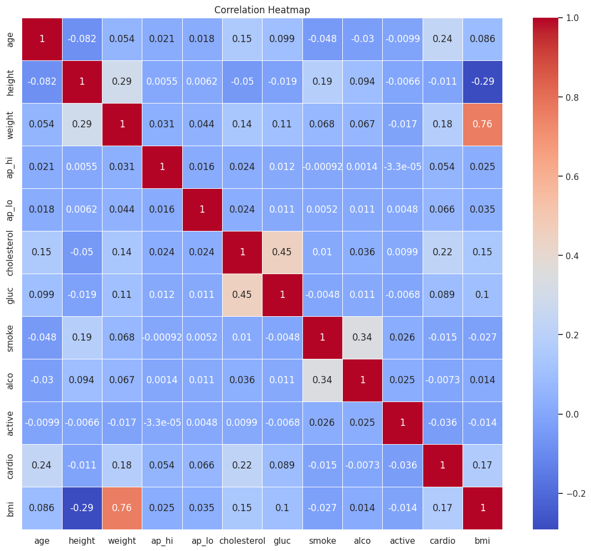
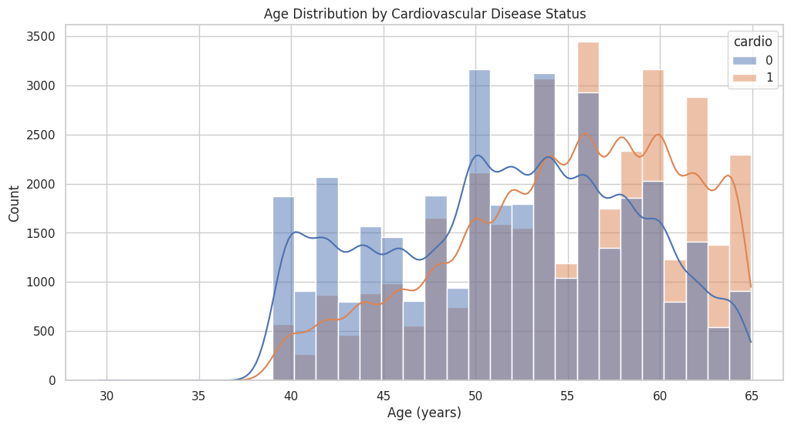
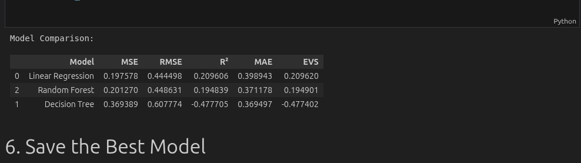

# Cardiovascular Disease Prediction App

## Mission & Problem
### Problem
Cardiovascular diseases are a leading cause of death worldwide, often going undetected until advanced stages. Early risk assessment is crucial, but many lack access to timely, personalized tools.

### Mission
To reduce complications from late-detected cardiovascular diseases by providing accessible, data-driven risk assessment through digital tools.

---

## Dataset
**Use Case:**
This project predicts individual cardiovascular disease risk using real patient health metrics, enabling targeted prevention and early intervention. The use case is specific to cardiovascular risk, not generic.

**Dataset Description:**
- **Source:** [UCI Machine Learning Repository: Cardiovascular Disease Dataset](https://www.kaggle.com/datasets/sulianova/cardiovascular-disease-dataset)
- **Volume:** 70,000+ records
- **Variety:** Includes age, gender, height, weight, blood pressure, cholesterol, glucose, smoking, alcohol, and activity status.

**Sample Features:**
- Age (in days)
- Gender (1=female, 2=male)
- Height (cm)
- Weight (kg)
- Systolic/Diastolic Blood Pressure
- Cholesterol, Glucose (3 levels)
- Smoking, Alcohol, Physical Activity (binary)

**Visualizations:**

 <em>Correlation heatmap: Shows relationships between variables and the target.</em>

 <em>Age distribution by cardiovascular disease status.</em>

---

## Model Implementation
The following models were implemented and compared:
- **Linear Regression**
- **Decision Tree Regressor**
- **Random Forest Regressor**

The model with the lowest loss (best performance) is automatically saved and used for predictions.

**Key Features:**
- Code for making a prediction on a single data point (one row of test data) is included.
- A Table showing modal comparision is shown:

 <em>Scatter plot: Actual vs. Predicted values for Linear Regression.</em>

---

## API
- **Prediction endpoint:** `/predict` (POST)
- **Swagger UI:** [https://cardio-prediction-q5ny.onrender.com/docs](https://cardio-prediction-q5ny.onrender.com/docs)
- **CORS:** Enabled for all origins
- **Input validation:** All variables have constraints and types enforced using Pydantic
- **Datatypes:**
	- Age: int (days)
	- Gender: int (1=female, 2=male)
	- Height: int (cm)
	- Weight: float (kg)
	- ap_hi/ap_lo: int (mmHg)
	- Cholesterol/Glucose: int (1-3)
	- Smoke/Alco/Active: int (0/1)

---

## Mobile App
The Flutter app includes:
- A dedicated prediction page
- Text fields/dropdowns for all input variables
- A submit button
- Output display for the risk score and recommendations

---

## Video Demonstration
[Watch the 5-minute demo on YouTube](https://example.com/video-demo)  
*The video demonstrates:*
- The mobile app making predictions
- Swagger UI API tests
- Presenter on camera, clear explanation of model deployment, performance (loss metrics), and model selection

---